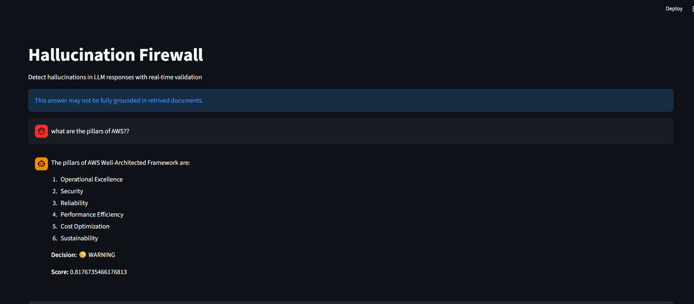
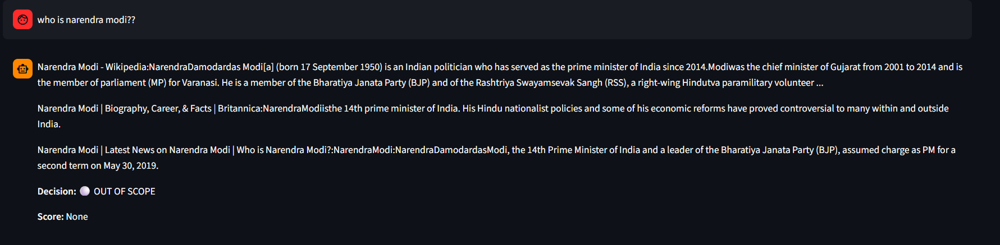

# Hallucination Firewall (MLOps)

## Overview

Large Language Models (LLMs) are powerful but unreliable in production due to **hallucinations**—responses that sound correct but are factually incorrect or unsupported.

This project presents a **Hallucination Firewall**, an end-to-end MLOps system that detects and controls hallucinated responses using a combination of **RAG (Retrieval-Augmented Generation)** and a **post-generation verification layer powered by machine learning**.

The system ensures that responses are **validated before being shown to the user**, significantly improving reliability.

---

## Problem Statement

Despite advances in Retrieval-Augmented Generation (RAG), LLMs still:

* Generate answers not grounded in retrieved documents
* Produce confident but incorrect responses
* Fail on out-of-scope queries

This creates a critical gap:

> There is no reliable mechanism to verify LLM outputs before presenting them to users.

---

## Solution

This project introduces a **post-generation verification system** that acts as a firewall between the LLM and the user.

Pipeline:

1. Retrieve relevant documents
2. Generate response using LLM
3. Evaluate grounding using similarity scoring
4. Extract structured features
5. Classify reliability using a machine learning model
6. Apply control logic to filter or modify output

This transforms a standard RAG pipeline into a **trust-aware LLM system**.

---

## What Makes This Project Unique

* Introduces a **post-generation verification layer** (not just RAG)
* Treats hallucination detection as a **classification problem**
* Combines **semantic similarity + ML decision making**
* Implements a **control layer** to enforce safe outputs
* Provides **fallback mechanisms** for out-of-scope queries
* Fully local execution using **Ollama (LLaMA3)**

> Unlike traditional systems, this project does not assume the LLM is correct—it verifies every response.

---

## System Architecture

```text
User Query
    ↓
Retrieval (FAISS + Sentence Transformers)
    ↓
LLM (Ollama - LLaMA3)
    ↓
Similarity Scoring
    ↓
Feature Extraction
    ↓
ML Model (Logistic Regression)
    ↓
Decision Engine
    ↓
Control Layer
    ↓
Final Output

OUT_OF_SCOPE → DuckDuckGo Web Fallback
```

---

## Tech Stack

* Backend: FastAPI
* Frontend: Streamlit
* LLM: Ollama (LLaMA3 - local inference)
* Vector Database: FAISS
* Embeddings: Sentence Transformers
* Machine Learning: Scikit-learn
* Search Fallback: DuckDuckGo

---

## Machine Learning Model

### Model

Logistic Regression

### Why Logistic Regression

* Fast and efficient for real-time inference
* Works well with small structured feature sets
* Provides interpretable decision boundaries
* Suitable for safety-critical systems

### Features Used

* Similarity score (cosine similarity between response and retrieved documents)
* Response length
* Number of retrieved documents
* Average document length

### Dataset

* Custom dataset built for hallucination detection
* Contains labeled samples:

  * SAFE
  * WARNING
  * HALLUCINATION
  * OUT_OF_SCOPE

Dataset link:
https://www.kaggle.com/datasets/tatapudibhaskar/dataset-on-hallucination-firewall

---

## Output Classes

* SAFE → Response is grounded and reliable
* WARNING → Partially grounded, needs caution
* HALLUCINATION → Likely incorrect or unsupported
* OUT_OF_SCOPE → Query outside knowledge base
* NO_CONTEXT → No relevant documents retrieved

---


---

## Control Layer

The control layer enforces reliability:

* SAFE → Return response
* WARNING → Display caution message
* HALLUCINATION → Restrict or modify output
* OUT_OF_SCOPE → Trigger web search fallback
* NO_CONTEXT → Inform user

---

## Challenges Faced

* Handling empty retrieval results (NO_CONTEXT)
* Differentiating hallucination vs out-of-scope queries
* Inconsistent LLM responses
* Designing meaningful features for classification
* Building a stable end-to-end pipeline
* Integrating local LLM (Ollama) with backend

---

## Future Improvements

* Add evaluation metrics (Accuracy, Precision, F1-score)
* Improve feature engineering (semantic overlap, similarity variance)
* Experiment with ensemble models
* Introduce feedback loop for continuous learning
* Deploy system using Docker and cloud platforms
* Build monitoring dashboard for predictions

---

## 📁 Project Structure

```
HALLUCINATION_FIREWALL/
│
├── app/
│   ├── api/
│   │   ├── app_ui.py          # Streamlit UI
│   │   ├── routes.py          # FastAPI routes
│   │
│   ├── core/
│   │   ├── config.py          # Configuration settings
│   │   ├── exception.py       # Custom exception handling
│   │   ├── logger.py          # Logging setup
│   │
│   ├── data_pipeline/
│   │   ├── chunk.py           # Document chunking
│   │   ├── embed_store.py     # Embedding + FAISS storage
│   │   ├── ingest.py          # Data ingestion pipeline
│   │   ├── run_pipeline.py    # Pipeline runner
│   │
│   ├── models/
│   │   ├── data_generator.py      # Dataset creation
│   │   ├── data_preprocessing.py  # Feature engineering
│   │   ├── model.py               # Logistic Regression model
│   │   ├── schema.py              # Data schema definitions
│   │   ├── notebook.ipynb         # Experimentation
│   │
│   ├── services/
│   │   ├── retrieval_service.py   # Document retrieval
│   │   ├── scoring_service.py     # Similarity scoring
│   │   ├── decision_service.py    # Classification logic
│   │   ├── control_service.py     # Output control layer
│   │
│   ├── utils/
│   │   ├── helpers.py             # Utility functions
│   │
│   ├── main.py                    # FastAPI app entry point
│
├── data/
│   ├── documents/                 # Source documents
│   ├── data_collected.json        # Training dataset
│   ├── faiss_index.index          # Vector index
│   ├── faiss_index.pkl            # Metadata
│   ├── model.pkl                  # Trained ML model
│   ├── label_encoder.pkl          # Label encoder
│
├── logs/                          # Application logs
├── test/                          # Test scripts
│
├── .env                           # Environment variables
├── .gitignore
├── Dockerfile                     # Containerization
├── requirements.txt
├── README.md
```


---

## How to Run

### 1. Clone Repository

```bash
git clone https://github.com/your-username/hallucination-firewall.git
cd hallucination-firewall
```

### 2. Create Virtual Environment

```bash
python -m venv venv
source venv/bin/activate   # Linux / Mac
venv\Scripts\activate      # Windows
```

### 3. Install Dependencies

```bash
pip install -r requirements.txt
```

### 4. Start Ollama (LLaMA3)

```bash
ollama run llama3
```

### 5. Run Backend (FastAPI)

```bash
uvicorn app.main:app --reload
```

### 6. Run Frontend (Streamlit)

```bash
streamlit run app/api/app_ui.py
```

---

## Screenshots



---

## Conclusion

This project demonstrates a practical approach to improving LLM reliability by introducing a **post-generation verification system**.

Rather than relying solely on RAG, it adds a **decision layer that evaluates and controls outputs**, making LLM applications safer for real-world deployment.

The Hallucination Firewall represents a step toward **trustworthy AI systems**, where responses are not just generated—but validated.

---

---

## 👨‍💻 Author

**Tatapudi Bhaskar Phaneendra**

---